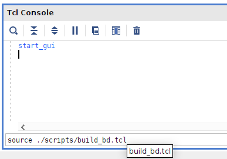

# How to run this lab? 
1. Launch vivado from this working directory. If you are using the apptainer container enter into a shell with `apptainer shell /shares/ziti-opt/software/cat/vivado_2024_2.sif`

2. Run `source scripts/build_bd.tcl` from the vivado .tcl shell

